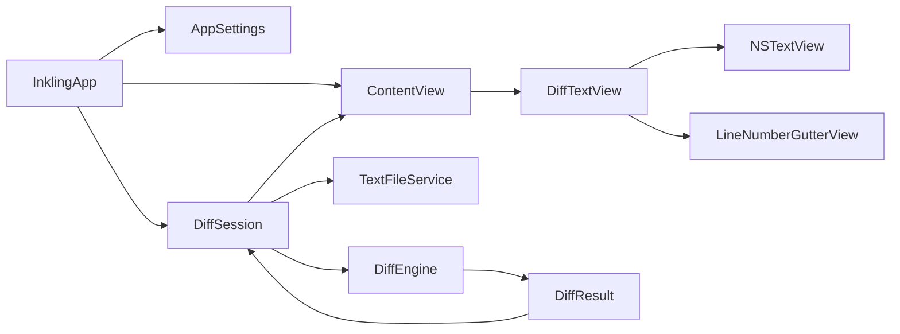

# Inkling Architecture

## Overview

Inkling is a Swift 6 executable packaged as a native macOS 14 application.
SwiftUI owns application composition and observable state injection; AppKit owns
the editing surfaces and native document interactions.



## Component Map

| Component | Responsibility |
| --- | --- |
| `InklingApp.swift` | App lifecycle, commands, Settings scene, quit guard |
| `ContentView.swift` | Window composition, equal panes, drop wells, center rail, status, palette |
| `DiffTextView.swift` | SwiftUI/AppKit bridge, editing, wrapping, temporary highlights, navigation reveal, drag interception, scroll/caret sync |
| `LineNumberRulerView.swift` | Independent line-number gutter |
| `DiffSession.swift` | URLs, text, saved baselines, revisions, async refresh, navigation, transfer, saving, alerts |
| `DiffEngine.swift` | Line alignment, changed-line pairing, semantic/token/character refinement |
| `Models.swift` | Diff ranges, changes, hunks, highlights, loaded files, errors |
| `TextFileService.swift` | Size checks, strict decoding, binary rejection, atomic UTF-8 writes |
| `AppSettings.swift` | Persisted algorithms, shortcuts, editor options, highlight style, palette |
| `L10n.swift` | String Catalog lookup from the packaged resource bundle |

## State Ownership

`AppSettings` and `DiffSession` are `@MainActor @Observable` reference types
created once by `InklingApp` and injected into SwiftUI's environment.

`DiffSession` is the source of truth for:

- the URL, text, and saved baseline of each side;
- dirty state and focused side;
- document and refresh revisions;
- the current `DiffResult` and navigation position;
- user-visible status and errors;
- weak references to both native editors.

Views derive presentation from that state. The native text views publish direct
edits back to the session through the representable coordinator.

## Comparison Pipeline

`DiffEngine.compare` produces 2 related structures:

- `DiffChange` is a semantic range used for counting and navigation.
- `DiffHunk` is a whole-line block used for safe transfer.

They must remain separate: a single hunk may contain several navigable changes.

The pipeline is:

1. Split both documents into lines while recording UTF-16 offsets compatible
   with `NSTextStorage`.
2. Normalize line keys when whitespace is ignored.
3. Find ordered equal-line anchors with longest-common-subsequence matching.
4. Turn gaps between anchors into changed line blocks.
5. Pair similar lines inside each block using character similarity and ordered
   dynamic programming.
6. Refine each pair according to the selected algorithm:
   - semantic: stable word anchors, phrase classification, similar-word pairing,
     then exact character refinement;
   - word: unmatched word and punctuation tokens;
   - character: unmatched extended grapheme clusters;
   - line: the complete paired line.
7. Mark unpaired lines as additions or deletions.
8. Derive ordered top-level `DiffChange` ranges and their containing
   `DiffHunk`.

Dynamic-programming matrices are limited to 250,000 cells. Larger inputs use
bounded prefix/suffix or positional fallbacks rather than allocating an
unbounded matrix.

## Recompute and Revision Safety

Every text mutation increments `documentRevision`. Recompute requests also
receive a `refreshRevision`.

```mermaid
sequenceDiagram
    participant Editor as NSTextView
    participant Session as DiffSession
    participant Engine as DiffEngine
    Editor->>Session: publish edited text
    Session->>Session: increment revisions; cancel prior task
    Session->>Engine: compare immutable text snapshots
    Engine-->>Session: DiffResult
    Session->>Session: validate task and document revisions
    Session-->>Editor: publish highlights if still current
```

Interactive edits are debounced by 120 milliseconds. CPU-bound comparison runs
in a detached user-initiated task using immutable, `Sendable` inputs. Cancelled
or stale results are discarded before observable state changes.

Copy Block also requires the result's stamped document revision to match the
current session revision. This prevents a visible-but-outdated hunk from
mutating a newer document.

## Native Editor Bridge

`DiffTextView` wraps an `NSTextView` inside a custom AppKit container:

- the line-number gutter is a sibling of the scroll view, not an
  `NSRulerView`, so it cannot obscure leading glyphs;
- the text container tracks editor width and uses word wrapping;
- horizontal scrolling is disabled;
- drag interception sits above the editor so dropping a file opens it instead
  of inserting its path;
- highlights are temporary layout-manager attributes, keeping them out of file
  content and undo history;
- model-driven text replacement disables undo registration;
- direct editing follows the native delegate and text-storage lifecycle.

The root comparison uses `HSplitView` with explicit equal pane constraints and
a fixed-width center rail. This arrangement is an implementation invariant:
replacing it with a simple SwiftUI `HStack` has caused one editor to render
blank.

## Highlight Rendering

Highlights are applied from broadest to narrowest:

1. phrase, addition, and deletion;
2. word;
3. character.

This ordering ensures a nested character edit remains visible. Foreground mode
uses category text color and a thick character underline. Background mode uses
translucent category blocks with stronger character contrast. The current
navigation range receives a separate double accent underline and native find
indicator.

## Editing, Undo, and Saving

Direct typing uses the `NSTextView` undo manager. Copy Block uses:

1. revision and range validation;
2. `shouldChangeText(in:replacementString:)`;
3. a named undo group;
4. `NSTextStorage.replaceCharacters`;
5. `didChangeText()`.

The destination editor therefore sees one native, undoable operation. Loading a
new file clears only that pane's undo history.

Dirty state is computed by comparing current text with the last successfully
loaded or saved baseline. Save Both attempts each dirty side independently,
updates successful baselines, retains failed sides as dirty, and reports partial
failure.

## File I/O

`TextFileService` canonicalizes URLs, memory-maps when safe, enforces a 5 MiB
limit, and strictly decodes:

- UTF-8;
- UTF-8 with BOM;
- UTF-16 little-endian with BOM;
- UTF-16 big-endian with BOM.

Null bytes and malformed encodings are rejected as binary or unsupported data.
Writes are atomic UTF-8. Original encoding and BOM preservation are not yet
implemented.

## Resources and Packaging

SwiftPM compiles the String Catalog into `Inkling_Inkling.bundle`. The app
recipe copies that bundle to:

```text
Inkling.app/Contents/Resources/Inkling_Inkling.bundle
```

`L10n` first resolves this packaged location and falls back to SwiftPM's module
bundle for tests and command-line builds. `just verify-app` checks the resource,
performs strict deep code-sign verification, launches the executable, and
requires it to remain alive through the smoke-test interval.

## Validation

The test suite uses Swift Testing and covers:

- line, semantic, word, and character diff behavior;
- UTF-16-safe ranges and Unicode;
- navigation and stale-result rejection;
- dirty state, replacement guards, partial saves, and native undo;
- strict encoding and file-size behavior;
- pane geometry and AppKit highlight rendering;
- persisted settings and custom palettes.

Use focused tests while iterating and run `just check` before landing changes
that affect application behavior or packaging.
